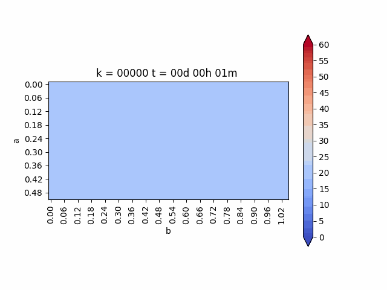

# MCOC2020-P3-E7

Si bien se logró simular de buena manera los efectos de la temperatura en los ejes centrales del bloque de hormigón, no se pudo simular la temperatura en los sensoreas, ya que por la complejidad del código este no generaba las imagenes de manera rápida. Además, debido a problemas de conexión con el cluster, no se pudo correr el código en su totalidad para obtener los gráficos correctos.

